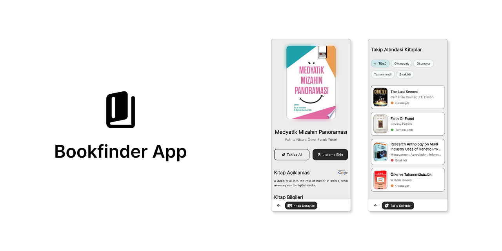
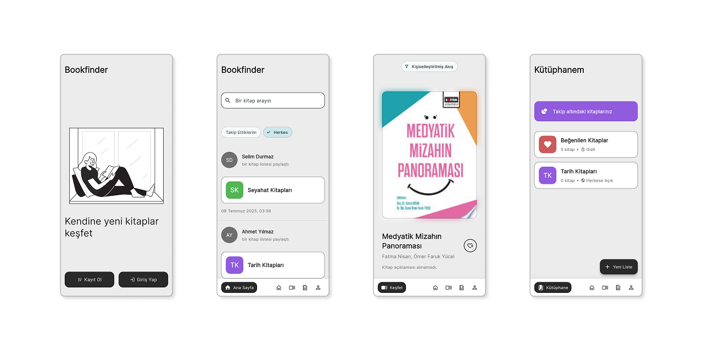
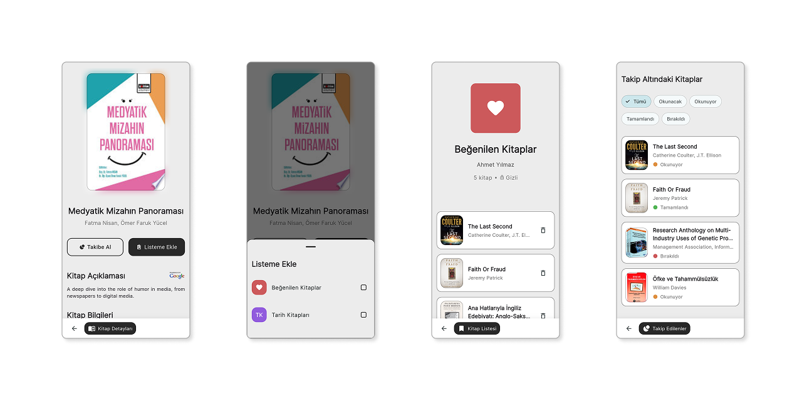

# 📚 Bookfinder App

A comprehensive book discovery and tracking mobile application built with Flutter. Discover new books, track your reading progress, create custom book lists, and connect with other book lovers.



## ✨ Features

### 🔍 Book Discovery
- **Search Books**: Find books by title with powerful search functionality
- **Personalized Recommendations**: Get book recommendations based on your preferences
- **Category Filtering**: Filter recommendations by book categories
- **Book Details**: View comprehensive information including authors, descriptions, and ISBN data

### 📖 Reading Tracking
- **Reading Status**: Track books as "Will Read", "Reading", "Completed", or "Dropped"
- **Status Filtering**: Filter your tracked books by reading status
- **Progress Management**: Easy-to-use interface for updating reading progress

### 📋 Book Lists & Library
- **Custom Book Lists**: Create and manage personalized book lists
- **Public & Private Lists**: Share your lists publicly or keep them private
- **Favorites Management**: Special "Liked Books" list for your favorites
- **List Organization**: Add/remove books from multiple lists

### 👥 Social Features
- **User Profiles**: View your own and other users' profiles
- **Follow System**: Follow other users to see their book activities
- **Activity Feed**: Stay updated with book activities from users you follow
- **Public List Sharing**: Discover book lists shared by other users

### 🎨 Modern UI/UX
- **Material Design**: Clean and intuitive interface following Material Design principles
- **Turkish Localization**: Full Turkish language support
- **Responsive Design**: Optimized for different screen sizes
- **Custom Icons**: Beautiful custom iconography for enhanced user experience
- **Smooth Animations**: Engaging transitions and animations throughout the app




## 🏗️ Architecture

The app follows a clean architecture pattern with clear separation of concerns:

### Directory Structure
```
lib/
├── consts/              # Constants and configuration
├── controllers/         # Business logic controllers
├── exceptions/          # Custom exceptions and error handling
├── extensions/          # Dart extensions for utility functions
├── interfaces/          # Abstract interfaces and contracts
├── models/             # Data models and DTOs
├── screens/            # UI screens and pages
├── services/           # Business services (API, preferences, logging)
├── utils/              # Utility functions
└── widgets/            # Reusable UI components
```

### Key Components

#### 🔌 API Service Layer
- **Modular Design**: Separate subservices for different API endpoints
- **Mock Implementation**: Complete mock API for development and testing
- **Dio Integration**: HTTP client with interceptors for logging and error handling
- **Error Handling**: Comprehensive error handling with custom exceptions

#### 🗄️ Data Management
- **Token Management**: Secure authentication token handling
- **Local Preferences**: Persistent storage for user preferences
- **API Response Models**: Strongly typed response models

#### 🎯 Services
- **Authentication**: Login, register, and token refresh functionality
- **Book Data**: Search, recommendations, and detailed book information
- **Book Tracking**: Reading progress and status management
- **Library**: Book list creation, management, and sharing
- **User Management**: Profile management and social features
- **Feed**: Activity feed for social interactions

## 🚀 Getting Started

### Prerequisites
- Flutter SDK (≥3.5.4)
- Dart SDK
- Android Studio / VS Code
- Android SDK (for Android development)
- Xcode (for iOS development)

### Installation

1. **Clone the repository**
   ```bash
   git clone <repository-url>
   cd bookfinder_app
   ```

2. **Install dependencies**
   ```bash
   flutter pub get
   ```

3. **Run the app**
   ```bash
   flutter run
   ```

### API Configuration

The app supports both mock and real API implementations:

- **Mock API**: Uses local mock data for development and testing
- **Real API**: Connects to a backend server (configurable base URL)

The app will prompt for API base URL on first launch if connecting to a real backend.

## 📱 Screens & Navigation

### Main Navigation Tabs
- **🏠 Home**: Book recommendations and feed
- **🔍 Search**: Book search functionality
- **📚 Library**: Your book lists and tracked books
- **👤 Profile**: User profile and settings

### Key Screens
- **Authentication**: Welcome, login, and registration
- **Book Details**: Comprehensive book information and actions
- **Book Lists**: View and manage book collections
- **Tracked Books**: Monitor reading progress
- **Profile**: User profiles with social features
- **Search**: Find books and users

## 🛠️ Technical Stack

### Core Technologies
- **Flutter**: Cross-platform mobile development framework
- **Dart**: Programming language
- **Material Design**: UI/UX design system

### Key Dependencies
- **dio**: HTTP client for API requests
- **shared_preferences**: Local data persistence
- **google_fonts**: Custom typography
- **cached_network_image**: Efficient image loading and caching
- **flutter_svg**: SVG image support
- **animations**: Smooth page transitions
- **talker**: Comprehensive logging solution
- **intl**: Internationalization support

### Development Tools
- **Mock API**: Complete mock backend for development
- **Logging**: Comprehensive logging with Talker
- **Error Handling**: Custom error handling and user feedback
- **State Management**: Stateful widgets with proper lifecycle management

## 🔧 Development

### Code Organization
- **Clean Architecture**: Separation of concerns with clear layers
- **Interface-Based Design**: Abstract interfaces for easy testing and mocking
- **Extension Methods**: Utility extensions for common operations
- **Error Handling**: Comprehensive error handling with user-friendly messages

### Testing
- Mock API implementation allows for thorough testing without backend dependency
- Comprehensive error handling ensures robustness
- Type-safe models prevent runtime errors

## 🎨 UI/UX Features

### Design Elements
- **Custom Bottom Navigation**: Intuitive navigation with custom icons
- **Hero Animations**: Smooth transitions between screens
- **Responsive Layout**: Adapts to different screen sizes
- **Custom Components**: Reusable UI components for consistency

### User Experience
- **Pull-to-Refresh**: Refresh data with intuitive gestures
- **Loading States**: Clear loading indicators
- **Error States**: Helpful error messages and retry options
- **Empty States**: Engaging empty state designs

## 📝 Contributing

1. Fork the repository
2. Create a feature branch
3. Make your changes
4. Write tests if applicable
5. Submit a pull request

## 📄 License

This project is licensed under the MIT License - see the LICENSE file for details.

---

Made with ❤️ by **Berk Akkaya**.
